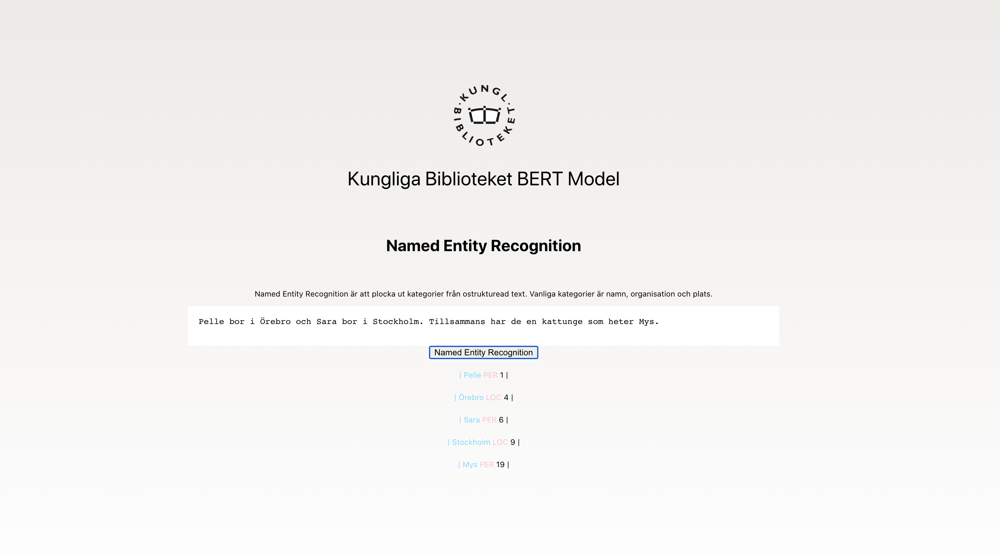

## Swedish BERT Ner Application


A web app for showing of the Swedish BERT.

## Running
Clone the repo

## Frontend

```js
npm install
npm start   
```

## Backend
```bash
cd backend
uvicorn main:app --reload --port 8020
```

This should make everything work and your web app shuld be live at 
localhost:3000 (or another port you decide).

## Language model
```python
class LanguageModel:
    def __init__(self, nlp):
        self.nlp = nlp

    def named_entity_recognition(self, text):
        l = []
        t = self.nlp(text)
        in_word=False

        for i,token in enumerate(t):
            if token['entity'] == 'O':
                in_word = False
                continue

            if token['word'].startswith('##'):
                # deal with (one level of) orphaned ##-tokens
                if not in_word:
                    l += [ t[i-1] ]
                    l[-1]['entity'] = token['entity']
                
                l[-1]['word'] += token['word'][2:]
            else:
                l += [ token ]

            in_word = True

        #print(l)
        return(l)

```
The language model is a class with only one function, named_entity_recognition.

## Running inside the Fast API Webserver
```python
@app.post("/ner")
async def ner_response(textRequest: TextRequest):
    #print("inside with item", textRequest)
    languageModel = LanguageModel(pipeline('ner', model='KB/bert-base-swedish-cased-ner', tokenizer='KB/bert-base-swedish-cased-ner', ignore_labels=[]))
    response = languageModel.named_entity_recognition(textRequest.text)
    print(response)

    return {
        "text": response }

```

The webserver creates a language model and runs inference onit and sends the response back to the client.

## Frontend code
```js

async function namedEntityRecognition(text) {
  let data = {
    text: text
  }

  let response = await fetch("http://localhost:8020/ner", 
    {
    method: "POST",
    contentType: "application/json",
    body: JSON.stringify(data)
  })

  let responseJson = await response.json()

  console.log("the response json", responseJson)

  if (responseJson && responseJson.text) {
    setNer(responseJson.text)
  }

  return responseJson
}
```

The fronten code sends a requests to the backend and displays the result.